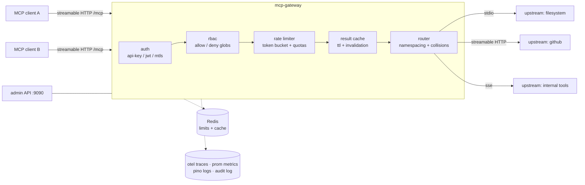

# mcp-gateway

[](https://github.com/adeen-s/mcp-gateway/actions/workflows/ci.yml)
[](LICENSE)
[](package.json)

A production-grade gateway for the **Model Context Protocol**: one secure, observable endpoint in front of all your MCP servers.

Point your MCP clients at a single URL. The gateway aggregates any number of upstream MCP servers (stdio or streamable HTTP/SSE), namespaces their tools and resources, authenticates callers into tenants, enforces per-tenant RBAC and rate limits, caches idempotent results, and emits traces, metrics, and a full audit log — with circuit breakers and retries protecting every upstream.

## Why

MCP adoption inside an org turns into N clients × M servers very quickly. Every client carries its own credentials for every server, there is no central policy, no usage attribution, no rate control, and a flaky server takes agents down with it. `mcp-gateway` collapses that into client → gateway → servers: one auth surface, one policy engine, one place to look when something breaks.

## Features

- **Multiplexing** — aggregate many upstream MCP servers behind a single streamable-HTTP endpoint; stdio, streamable HTTP, and SSE upstream transports; tools exposed as `<upstream>__<tool>` with configurable separator and collision handling (`error` or first-wins).
- **Pluggable auth** — API keys, OAuth2 bearer/JWT (JWKS or HMAC), and mTLS client certificates, each resolving to a tenant identity; providers chain in order.
- **Per-tenant RBAC** — allow/deny lists over namespaced tool names and resource URIs with glob patterns; deny wins; unknown tenants are rejected; tool/resource listings are filtered to what each tenant may see.
- **Rate limiting & quotas** — token-bucket per tenant and per tool, plus hard daily quotas; in-memory backend for dev, Redis (atomic Lua) for multi-replica deployments.
- **Result caching** — opt-in TTL cache for idempotent tool calls (glob-selected), memory or Redis backed, with exact/glob/full invalidation via the admin API; error results are never cached.
- **Observability** — OpenTelemetry traces (OTLP export), Prometheus metrics endpoint, structured pino logs, and a request/response audit trail (stdout or file sink).
- **Resilience** — periodic upstream health checks, three-state circuit breakers with bounded half-open probes, per-call timeouts, exponential-backoff retries with jitter (idempotent operations only — tool calls are never blindly retried).
- **Admin surface** — zod-validated YAML config with `${ENV}` interpolation, plus an admin HTTP API: upstream health, tenant listing, cache invalidation, config hot-reload.

## Architecture



Every upstream connection is wrapped with lazy reconnect, a circuit breaker, timeouts, and health checks; the router skips unhealthy upstreams during discovery so one bad server can't take down `tools/list` for everyone.

## Quickstart

### docker-compose (gateway + Redis + example upstream)

```bash
git clone https://github.com/adeen-s/mcp-gateway && cd mcp-gateway
docker compose up --build
```

Then call it like any MCP server:

```bash
npx @modelcontextprotocol/inspector --transport http \
  --url http://localhost:8080/mcp \
  --header "x-api-key: dev-acme-key-123"
```

### From source

```bash
npm ci
cp .env.example .env
npm run dev -- --config config/example.yaml
```

The example config spawns the bundled echo upstream (`examples/upstream-echo`) over stdio, so it works with zero external dependencies.

## Configuration

Config is a single YAML file (`--config path` or `MCP_GATEWAY_CONFIG`), validated by a zod schema with helpful errors. `${VAR}` and `${VAR:-default}` are interpolated from the environment, so secrets stay out of the file. See [`config/example.yaml`](config/example.yaml) for the annotated reference; the high-level shape:

```yaml
server:     { port: 8080, path: /mcp }       # public MCP endpoint (TLS/mTLS optional)
admin:      { port: 9090, token: ${ADMIN_TOKEN} }
namespace:  { separator: "__", onCollision: error }
upstreams:  [...]                            # stdio | http | sse, each with timeout/retry/breaker
auth:       { providers: [...] }             # apiKey | jwt | mtls -> tenant id
tenants:    [...]                            # rbac + rate limits per tenant
rateLimit:  { backend: memory | redis }
cache:      { enabled: true, tools: [...] }  # idempotent tool globs
observability: { logLevel, metrics, tracing, audit }
```

### Auth examples

```yaml
auth:
  providers:
    # API keys (header configurable)
    - type: apiKey
      header: x-api-key
      keys:
        - { key: ${ACME_API_KEY}, tenant: acme }

    # OAuth2 / JWT bearer — JWKS or HMAC, tenant taken from a claim
    - type: jwt
      jwksUri: https://auth.example.com/.well-known/jwks.json
      audience: mcp-gateway
      tenantClaim: tenant

    # mTLS — enable client certs under server.tls, then map them
    - type: mtls
      certs:
        - { subjectCN: acme.client, tenant: acme }
```

### RBAC & rate limits

```yaml
tenants:
  - id: acme
    rbac:
      allowTools: ["github__*", "search__*"]   # allow-list (optional)
      denyTools: ["github__delete_*"]          # deny always wins
    rateLimit:
      requests: { ratePerSec: 10, burst: 20 }  # tenant-wide
      perTool:
        search__web: { ratePerSec: 1, burst: 3 }
      dailyQuota: 5000
```

## Observability

- `GET :9090/metrics` — Prometheus metrics (request counts/latency by tenant and tool, cache hit/miss, breaker state, upstream health).
- OpenTelemetry tracing — set `observability.tracing.enabled: true` and an OTLP endpoint; each gateway hop (auth → rbac → limit → cache → upstream call) is a span.
- Audit log — one structured JSON line per request with tenant, tool, decision, latency, and truncated args/result, to stdout or a file.

## Admin API

Bearer-token protected (`admin.token`), bound to localhost by default:

| Route | Purpose |
|---|---|
| `GET /healthz` | gateway liveness |
| `GET /admin/upstreams` | upstream health + circuit state |
| `GET /admin/tenants` | configured tenants |
| `POST /admin/cache/invalidate` | body `{"tool": "search__*"}`, omit for full flush |
| `POST /admin/reload` | re-read + validate config, hot-swap routing/policies |

## Development

```bash
npm run typecheck   # tsc strict
npm run lint        # eslint
npm test            # vitest — unit + stdio integration tests
npm run build       # emit dist/
```

The integration tests spawn the real example upstream over stdio through the actual SDK transports — no mocks of the protocol layer.

## License

[MIT](LICENSE) © [Adeen Shukla](https://github.com/adeen-s)
